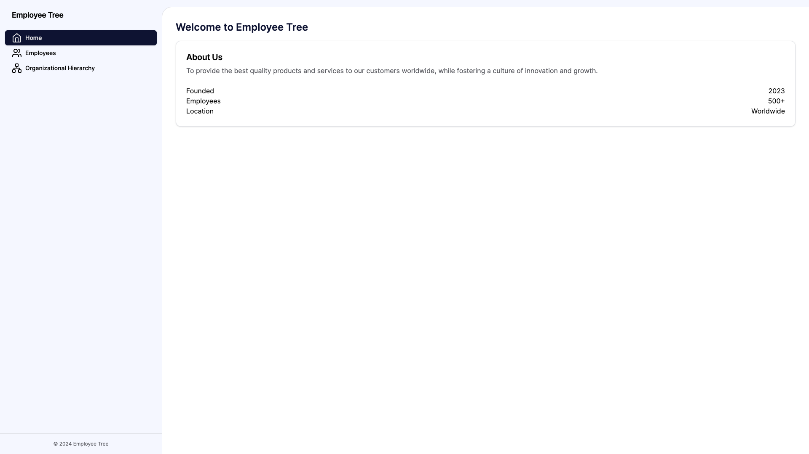
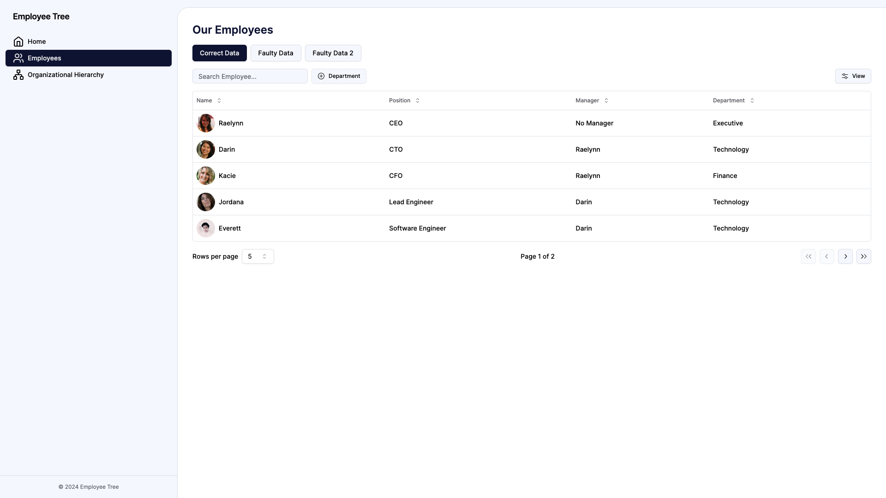
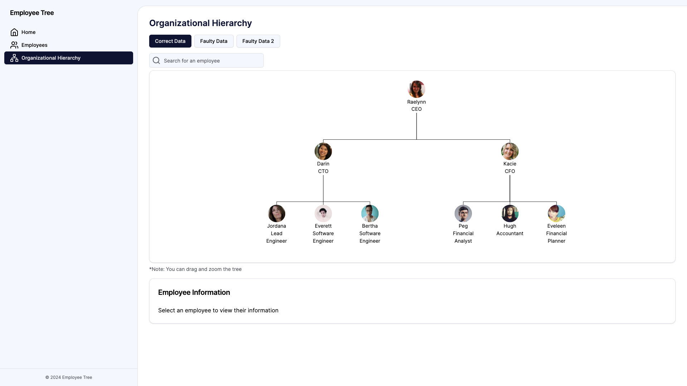

# Employee Tree

[](https://codecov.io/gh/whauzan/employee-tree)

Employee Tree is a web application that allows you to visualize the hierarchy of employees within an organization. It takes a list of employees, each with an ID, a manager ID, and a list of direct reports, and builds a tree structure that represents the hierarchy of the organization.

The PRD can be seen here [PRD](public/PRD.pdf)





## Technology Stack

This application is built using [Next.js](https://nextjs.org/), a popular React framework for building web applications. It also uses TypeScript for static type checking, and Jest for unit testing. The application follows a Model-View-Controller (MVC) architecture, with the `Employee` class representing the model, the `EmployeeService` class acting as the controller, and the Next.js pages serving as the views.

[React-D3-Tree](https://github.com/bkrem/react-d3-tree) is used to build the tree visualization with a custom node component. For styling, TailwindCSS is used.

## Visit Deployed Web

You can visit the deployed version on https://employee-tree.whauzan.dev/

## Running the Application Locally

To run the application locally, you need to have Node.js and npm installed on your machine. Once you have these prerequisites, follow these steps:

1. Clone the repository to your local machine:

   ```bash
   git clone https://github.com/whauzan/employee-tree.git
   ```

2. Navigate to the project directory:

   ```bash
   cd employee-tree
   ```

3. Install the dependencies:

   ```bash
   npm install
   # or
   yarn install
   # or
   pnpm install
   # or
   bun install
   ```

4. Run the development server:

   ```bash
   npm run dev
   # or
   yarn dev
   # or
   pnpm dev
   # or
   bun dev
   ```

5. Open `http://localhost:3000` with your browser to see the result

Or, you can use docker to run the application. You need to have Docker installed on your machine. Once you have these prerequisites, follow these steps:

1. Pull the docker image to your local machine:

   ```bash
   docker pull whauzan/employee-tree:latest
   ```

2. Run the application:

   ```bash
   docker run --rm -p 3000:3000/tcp whauzan/employee-tree:latest
   ```

3. Open `http://localhost:3000` with your browser to see the result

## Testing

To run the unit tests, use the following command:

```bash
npm run test
# or
yarn test
# or
pnpm test
# or
bun test
```

This will run the Jest test suite and output the results in the terminal.
